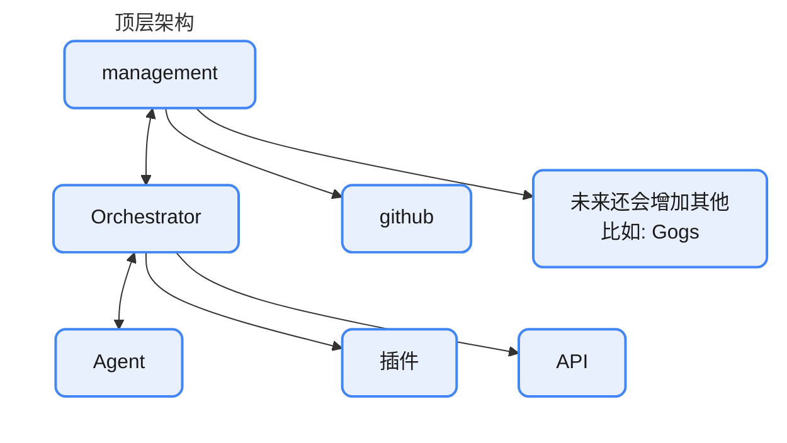

```mermaid
graph TD
    %% 定义样式类
    classDef default fill:#e8f0fe,stroke:#4285f4,stroke-width:2px,color:#1a1a1a,rx:8px,ry:8px;
    
    %% 顶层核心架构
    subgraph Top [顶层架构]
        direction LR
        M[management] <--> O[Orchestrator] <--> A[Agent]
    end

    %% management 分支
    M --> GH[github]
    M --> FUT[未来还会增加其他<br/>比如: Gogs]

    %% Orchestrator 分支
    O --> PL[插件]
    O --> API[API]

    %% 隐藏顶层子图的边框，使其看起来更整洁
    style Top fill:none,stroke:none;

```